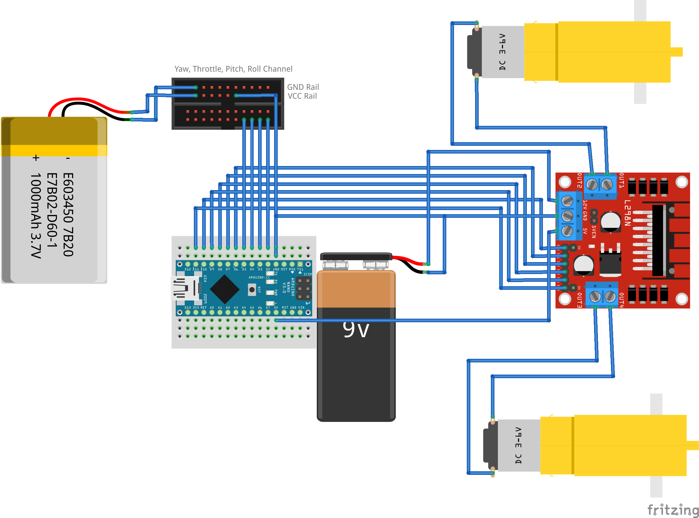

# Introduction

This project determines to use an RC controller to control an dual motor ground rover(differential drive)

# Equipment

The code has been tested with the following hardware

- Flysky-iA10B 6-channel reciever

- Flysky-i6S RC controller

The choice of controller can be different as only channels from reciver matter

- Arduino Nano

- L298 motor driver

- 2 motors

- battery pact

# How to Use

## Binding Controller with Reciever

1. Connect binding pin to the B/VCC column on the reciever

2. Give power and ground to the reciever, this can be done by using a ESC or use the Arduino power

3. Turn on the controller by pressing both the buttons with power symbol

4. On the touch screen, press the lock button for 2 sec

5. Click "System" on the top right, it opens the system settings

6. Click on RX Bind, it will bind with the reciever

## Connecting Reciever to the Arduino

The reciever sends the outputs on the individual channels as PWM as well as all channel on a single output as PPM

We are going to use individual PWM channel

1. Remove the binding pin

2. Connect and ESC to the reciever for regulated voltage. 

3. Connect the VCC and GND to the arduino, the middle row is VCC and bottom row is GND, connecting just one column is okay

4. Connect the signal pins on the top row. The exact connection is given in [[main/main.ino|code]]

5. Connect the motor to the motor driver and then to the arduino as given in [[main/main.ino|code]]

6. Upload the code

## Connecting Arduino to the Motor Driver

1. Connect a battery pack to the 12V and GND pins of L298

2. Connect 5V of L298 to 5V of arduino and not to Vin

3. Connect GND of L298 to arduino for common ground

4. Remove jumpers of enable pins of L298

DO NOT REMOVE JUMPER of enable 5V pin

5. Connect all input pins and enable pins of L298 to arduino to digital pins as given in [[main/main.ino|code]]

6. Connect the motor to the L298 outputs as required

Finally the Connection should look like

